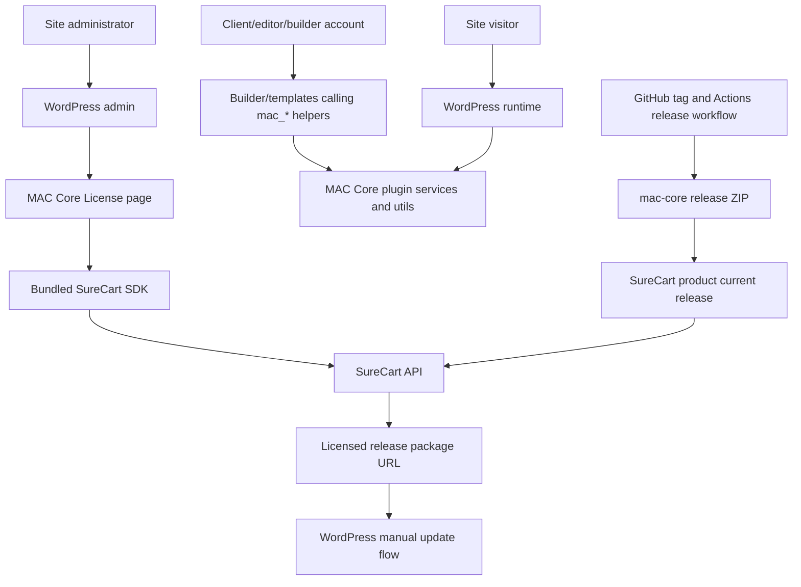

# MAC Core Threat Model

Date: 2026-04-08
Branch reviewed: `dev`

## Executive Summary

MAC Core has a small direct attack surface: it bootstraps OOP services, registers WordPress hooks, exposes template helper functions, and integrates SureCart licensing for manual licensed updates. The most important risks are not public unauthenticated web endpoints. They are:

- XSS through helper output when client/template access is compromised or misused. This was partially mitigated during this review by escaping plain helper returns.
- Malicious update distribution if the GitHub release ZIP or SureCart release configuration is compromised.
- License activation/deactivation abuse if the vendored SDK form handler ever becomes reachable without the intended `manage_options` gate.
- Security patch delay if automatic updates are disabled without a manual patching process.

## Scope And Assumptions

In scope:

- MAC Core plugin code under `mac-core.php`, `inc/`, `src/`, `assets/`, and `uninstall.php`.
- Bundled SureCart SDK files under `licensing/src/`.
- Release metadata and release workflow.

Out of scope:

- WordPress core internals.
- SureCart platform internals.
- Hosting/server configuration.
- Other plugins and themes, except where they can call MAC Core helpers or filter MAC Core/SureCart behavior.

Assumptions confirmed or used:

- Some client accounts may be able to access plugin/builder/template functionality and call `mac_*` helpers.
- MAC Core intentionally disables WordPress background automatic updates.
- The SureCart store/admin path is operated by a single trusted admin with strong passwords; 2FA is planned.
- GitHub-generated release ZIPs are intended to be uploaded manually to SureCart and marked as the current release.

## System Model

## Assets And Security Objectives

Assets:

- WordPress site integrity and admin sessions.
- MAC Core plugin PHP code and release ZIPs.
- SureCart license keys, license IDs, and activation IDs stored in WordPress options.
- SureCart public token. This is low sensitivity but should still not be confused with a secret token.
- GitHub repository, release tags, workflow, and release assets.
- SureCart store admin account and product release configuration.
- Client-managed content and builder/template configuration.

Security objectives:

- Prevent client-controlled or compromised client content from executing script in admin or frontend contexts.
- Ensure only trusted admins can activate or deactivate licenses.
- Ensure updates come only from intended GitHub tag-built ZIPs uploaded to SureCart.
- Keep emergency security patches deliverable despite disabled automatic updates.
- Preserve plugin OOP architecture and avoid introducing direct procedural admin handlers.

## Attacker Model

Relevant attackers:

- Anonymous visitor with no account.
- Authenticated client/editor/builder user with limited but meaningful content/template access.
- Compromised client/editor/builder account.
- Compromised WordPress administrator account.
- Malicious or compromised plugin/theme already executing code on the same site.
- Compromised GitHub account/workflow/action dependency.
- Compromised SureCart web app/store admin account.
- Network attacker between WordPress and SureCart, mitigated primarily by HTTPS/TLS.

## Entry Points

- WordPress plugin bootstrap in `mac-core.php`.
- WordPress hooks registered through `src/Kernel.php` and `src/Services/**`.
- Global helper functions in `src/Utils/**`, especially helpers callable from templates or builders.
- SureCart license admin page created by `src/Services/Licensing.php` and implemented by `licensing/src/Settings.php`.
- SureCart remote requests from `licensing/src/Client.php`.
- WordPress update transient filters in `licensing/src/Updater.php`.
- Release workflow in `.github/workflows/release.yml`.
- Manual SureCart product release upload and "current release" selection.

## Top Abuse Paths

### 1. Client/template XSS through helper output

Path:

Compromised or careless client account -> edits term/meta/date label/template input -> calls plain helper in a template -> raw output reaches browser -> script executes in a privileged browser context.

Current control:

Plain helper output was hardened during this review in `src/Utils/GetPostTerms.php` and `src/Utils/FormatDatetime.php`. HTML helper paths already escaped reviewed values.

Residual risk:

Future helpers or future `FormatDatetime` config changes can reintroduce raw output if output contracts are unclear.

Recommended controls:

- Treat all `mac_*` helper returns as browser-output-facing unless explicitly documented as raw.
- Add tests for escaped helper output.
- Avoid adding raw helper variants unless the name and documentation make the danger obvious.

### 2. Malicious plugin update through compromised release path

Path:

Attacker compromises GitHub tag/workflow/action or SureCart store admin -> malicious ZIP is produced or uploaded -> marked current release in SureCart -> licensed site admin runs manual update -> malicious PHP executes on site.

Current control:

Release ZIPs are generated from GitHub tag pushes, and release packaging excludes dev-only files. SureCart license updates depend on a configured license and SureCart current release.

Residual risk:

The SureCart web app admin and GitHub release path are now update control planes.

Recommended controls:

- Use 2FA on GitHub, SureCart, and `circea.co` WordPress admin if it can manage product/release data.
- Upload only the GitHub Actions ZIP for the intended tag.
- Verify the tag, workflow run, and release asset before SureCart upload.
- Add checksums or artifact attestations to the release process.
- Pin GitHub Actions to full commit SHAs.

### 3. License activation/deactivation abuse

Path:

Attacker obtains a valid admin nonce or finds a route to call the vendored SDK page callback -> submits activate/deactivate request -> license key/activation state changes.

Current control:

The license page is registered with `manage_options`, the form has a nonce, and inputs are sanitized before API calls.

Residual risk:

`licensing/src/Settings.php::license_form_submit()` does not perform an explicit capability check before processing `$_POST`.

Recommended controls:

- Add an upstream issue/PR or documented local vendor patch to check `current_user_can( $this->menu_args['capability'] )` before nonce verification and mutation.
- Keep using `manage_options` for the license page.

### 4. Security patch delay due disabled automatic updates

Path:

Vulnerability exists in MAC Core or another plugin/theme/core -> WordPress automatic updates are disabled -> no one manually applies update quickly -> attacker exploits known issue.

Current control:

This is intentional MAC Core behavior in `DisableAutoUpdates`.

Residual risk:

Manual update discipline is required.

Recommended controls:

- Keep a release notification process.
- Define manual patch SLA for security releases.
- Document that licensed SureCart updates are manual dashboard updates because auto-updates are disabled.

## Threat Table

| Threat | Entry Point | Impact | Likelihood | Current Controls | Recommendation |
| --- | --- | --- | --- | --- | --- |
| Template/helper XSS | `src/Utils/**` global helpers | Admin/session compromise, frontend XSS | Medium when clients can edit templates | Escaping added for plain helpers; HTML helpers escape output | Add regression tests and document raw-output policy |
| Malicious licensed update | SureCart current release and WP updater | Full site compromise | Low to Medium | GitHub tag workflow builds ZIP; SureCart license gate | 2FA, checksums/attestations, tag/run verification, action SHA pinning |
| License form state mutation | `licensing/src/Settings.php` | License deactivation or wrong activation state | Low | `manage_options` menu page, nonce, sanitization | Add explicit capability check in vendor patch/upstream |
| Delayed security patches | `DisableAutoUpdates` service | Known-vulnerability exposure window | Medium without process | Intentional manual updates | Document patch SLA and release notification path |
| Malicious plugin/theme already on site filters endpoint/token | SureCart endpoint/token filters | License API redirection or leakage | Low as attacker already has code execution | Uses HTTPS default endpoint | Treat as post-compromise; monitor plugin inventory |
| Wrong release metadata | `release.json` and version files | Broken updates or wrong package exposure | Medium operationally | Release skill/version checklist | Add automated release metadata tests |

## Criticality Calibration

No critical issue was identified in the plugin source during this review. The highest-risk scenario is malicious update distribution, but that requires compromise or operator error in the release/SureCart control plane rather than an unauthenticated code path in MAC Core.

## Focus Paths For Follow-Up

- Add tests for escaped helper output.
- Decide whether to vendor-patch the SureCart SDK capability check or file an upstream issue first.
- Add release ZIP checksum/provenance to the release process and SureCart upload checklist.
- Pin release workflow actions to immutable SHAs.
- Document the exact manual update workflow: release on `dev`, tag from clean `main`, GitHub builds ZIP, verify asset, upload that ZIP to SureCart product release, mark it current, then licensed WordPress sites can manually update from the dashboard.

## Sources

- [WordPress Nonces](https://developer.wordpress.org/apis/security/nonces/)
- [WordPress current_user_can()](https://developer.wordpress.org/reference/functions/current_user_can/)
- [WordPress Escaping Data](https://developer.wordpress.org/apis/security/escaping/)
- [GitHub Actions Secure Use](https://docs.github.com/en/actions/reference/security/secure-use)
- [SureCart WordPress SDK](https://github.com/surecart/wordpress-sdk)
