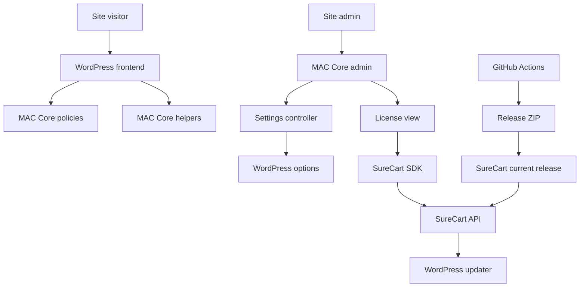

## Executive summary

MAC Core has a small direct attack surface. Its own runtime is mostly WordPress hook registration, settings persistence behind `manage_options`, helper functions that can be called from templates, and a licensing/update bridge to SureCart. No critical MAC Core-owned issue was identified in this review. The highest-risk area is the release and licensed-update control plane: GitHub Actions builds the authoritative ZIP, that ZIP is manually uploaded to SureCart, and licensed sites consume update metadata from SureCart. The main code-level risks are lower-privilege content flowing into future helper output, admin misuse of privileged settings paths, and inherited vendor behavior in the SureCart SDK.

## Scope and assumptions

In-scope paths:

- `mac-core.php`
- `inc/`
- `src/`
- `uninstall.php`
- `.github/workflows/`
- `release.json`
- `inc/Vendor/SureCart/Licensing/` as inherited dependency surface only

Out-of-scope items:

- WordPress core internals
- SureCart SaaS internals
- SureCart SDK internals as a local remediation target
- hosting/server hardening
- other plugins/themes except where they interact with MAC Core

Assumptions:

- Admin-capable compromise is in scope, but ranked lower than public or lower-privilege attack paths.
- The authoritative release artifact is the GitHub Actions-built ZIP, not a locally hand-zipped copy.
- The GitHub-built ZIP is manually uploaded to SureCart and set as the current release.
- Single-maintainer ownership is an accepted operational constraint.
- `inc/Vendor/SureCart/Licensing/` is accepted as upstream-owned vendored code and will not be locally patched unless the integration itself requires it.

Open questions that would materially change the risk ranking:

- None at the moment; the service/release context needed for this pass was clarified.

## System model
### Primary components

- `mac-core.php` bootstraps the plugin and hands control to [Kernel.php](D:/business/projects/mac-core/src/Kernel.php).
- Admin UI is handled by [AdminPage.php](D:/business/projects/mac-core/src/Admin/AdminPage.php).
- Settings writes are handled by [SettingsController.php](D:/business/projects/mac-core/src/Settings/SettingsController.php) and persisted through the settings repository.
- Policy services under `src/Policies/` change WordPress behavior based on stored settings.
- Helper functions under `src/Utils/` produce frontend/template-facing output.
- [LicensingService.php](D:/business/projects/mac-core/src/Licensing/LicensingService.php) loads the vendored SureCart SDK and exposes the license view.
- The vendored updater in [Updater.php](D:/business/projects/mac-core/inc/Vendor/SureCart/Licensing/Updater.php) injects licensed plugin update data into WordPress.
- GitHub Actions builds release artifacts, and SureCart serves the current release package to licensed sites.

### Data flows and trust boundaries

- Site visitor -> WordPress frontend -> MAC Core policies/helpers
  Data: content-derived text, taxonomy values, dates, rendered markup.
  Channel: standard WordPress request lifecycle / PHP rendering.
  Guarantees: WordPress auth where applicable; no plugin-owned public endpoint discovered.
  Validation: helper output escaping in `src/Utils/FormatDatetime.php` and `src/Utils/GetPostTerms.php`.

- WordPress admin -> MAC Core admin/settings
  Data: settings form input, tab routing, uninstall preference.
  Channel: wp-admin HTTP requests.
  Guarantees: `manage_options` access gate and nonce verification in `src/Settings/SettingsController.php`.
  Validation: nested settings payload normalized by the repository.

- WordPress site -> SureCart API via vendored SDK
  Data: public token, license state, release metadata, package URL.
  Channel: HTTPS requests from `inc/Vendor/SureCart/Licensing/Client.php`.
  Guarantees: remote HTTPS transport; license and update logic live partly in inherited SDK code.
  Validation: limited locally; this is a trust boundary into a third-party system and vendored dependency.

- GitHub Actions -> release ZIP -> operator upload -> SureCart current release -> licensed site update
  Data: build artifacts, checksum/provenance, release metadata, package URL.
  Channel: GitHub Actions artifact creation, manual operator upload, SureCart-hosted update metadata, WordPress update transient.
  Guarantees: release workflow, checksum/provenance files, immutable SHA-pinned actions.
  Validation: manual human verification still matters because the SureCart upload step is operator-controlled.

#### Diagram

## Assets and security objectives

| Asset | Why it matters | Security objective (C/I/A) |
| --- | --- | --- |
| Release ZIP and release metadata | A malicious or incorrect ZIP would ship arbitrary PHP to licensed sites | Integrity, Availability |
| SureCart product current-release state | Controls what licensed sites are offered as an update | Integrity |
| WordPress admin settings in `mac_core_settings` | Controls policy behavior, uninstall cleanup, and site-level hardening choices | Integrity, Availability |
| License state and local updater cache | Drives activation state and update availability | Integrity |
| Template/helper output | Unsafe output can become frontend or admin XSS | Integrity, Confidentiality |
| Last-login user meta | Limited sensitivity, but still plugin-owned per-user state | Confidentiality, Integrity |

## Attacker model
### Capabilities

- Anonymous visitor interacting with normal WordPress frontend routes.
- Authenticated lower-privilege user or builder/editor with content/template influence.
- Compromised admin-capable account.
- Compromised GitHub or SureCart operator account.
- Malicious or compromised co-installed plugin/theme with WordPress code execution.

### Non-capabilities

- No plugin-owned unauthenticated REST/AJAX/API surface was identified in this review.
- No direct shell-execution or arbitrary file-upload handler was identified in MAC Core-owned code.
- Attackers without access to GitHub/SureCart/operator control planes cannot directly publish a new licensed update through MAC Core alone.

## Entry points and attack surfaces

| Surface | How reached | Trust boundary | Notes | Evidence (repo path / symbol) |
| --- | --- | --- | --- | --- |
| Admin page routing | `wp-admin/admin.php?page=mac-core` | Admin browser -> plugin admin | Top-level UI, tab routing, support link rendering | `src/Admin/AdminPage.php::render`, `::redirect_default_view` |
| Settings save | POST on settings tab | Admin browser -> option mutation | Protected by `manage_options` and nonce | `src/Settings/SettingsController.php::handle_save` |
| Template helpers | Theme/builder/plugin calls | Content/template inputs -> browser output | Important for XSS resistance | `src/Utils/FormatDatetime.php`, `src/Utils/GetPostTerms.php` |
| Licensing integration | Admin license tab + remote API | Admin browser / site -> vendored SDK -> SureCart | Inherited dependency surface | `src/Licensing/LicensingService.php`, `inc/Vendor/SureCart/Licensing/Client.php`, `inc/Vendor/SureCart/Licensing/Updater.php` |
| Uninstall cleanup | Plugin deletion in WordPress | Admin action -> local data deletion | Controlled by explicit setting | `uninstall.php` |
| Release workflow | Tag push in GitHub | Repo -> GitHub Actions -> release artifact | Authoritative build path for SureCart upload | `.github/workflows/release.yml` |

## Top abuse paths

1. Attacker compromises GitHub or a workflow dependency, alters the release artifact, and the operator uploads that ZIP to SureCart as the current release, leading licensed sites to install malicious code.
2. Attacker compromises the SureCart operator account, swaps the current release package, and an admin on a licensed site manually updates to the malicious package.
3. Lower-privilege content or template input reaches a future helper that returns unsafe plain output, causing frontend or builder-context XSS.
4. A compromised admin account changes MAC Core settings, including uninstall cleanup or policy toggles, to weaken site behavior or erase plugin-owned state on removal.
5. A flaw in the inherited vendored SureCart SDK affects activation or update flows on the site, and MAC Core consumes that behavior because the SDK is loaded locally.

## Threat model table

| Threat ID | Threat source | Prerequisites | Threat action | Impact | Impacted assets | Existing controls (evidence) | Gaps | Recommended mitigations | Detection ideas | Likelihood | Impact severity | Priority |
| --- | --- | --- | --- | --- | --- | --- | --- | --- | --- | --- | --- | --- |
| TM-001 | Compromised GitHub action maintainer or GitHub operator | Attacker must gain control of the release workflow dependency or release pipeline | Alter release build behavior or output ZIP before SureCart upload | Licensed sites can install attacker-controlled plugin code | Release ZIP, customer site integrity | Immutable SHA pins in `.github/workflows/release.yml` and `.github/workflows/quality.yml`; checksum/provenance assets in `release.yml` | Manual SureCart upload is still a human-controlled step | Keep action SHAs current, verify checksum/provenance before SureCart upload, consider artifact attestations if release volume grows | Review workflow diff in PRs; verify release assets and provenance before upload | Low | High | medium |
| TM-002 | Compromised SureCart store operator account | Attacker must access the SureCart store managing the MAC Core product | Replace the current release or manipulate update metadata | Licensed sites receive a malicious or incorrect update offer | SureCart current-release state, release ZIP, customer site integrity | Manual upload discipline, GitHub-built authoritative ZIP, local updater cache in `inc/Vendor/SureCart/Licensing/Updater.php` | SureCart remains a single external control plane | Keep SureCart access minimal, enable 2FA, upload only the GitHub-built asset, verify current release before announcing updates | Audit SureCart release changes and compare uploaded ZIP hash to GitHub artifact | Low | High | medium |
| TM-003 | Lower-privilege builder/editor or compromised content path | Attacker must influence template inputs, taxonomy values, or helper arguments used in rendered output | Drive unsafe helper output into frontend or privileged browser contexts | XSS, session theft, admin action abuse | Template output, admin/browser sessions | Escaped plain helper output in `src/Utils/FormatDatetime.php` and `src/Utils/GetPostTerms.php` | Future helpers could regress if raw output contracts are unclear | Keep helper outputs escaped by default, add regression tests when new helpers land, document any intentional raw helper clearly | Add helper-focused unit tests and review new `mac_*` helpers during PRs | Low | Medium | low |
| TM-004 | Compromised admin-capable account | Attacker must already control an admin-capable WordPress account | Change policy settings, disable useful controls, or enable uninstall cleanup before deleting the plugin | Site behavior changes or plugin-owned data is removed | `mac_core_settings`, user meta, local license state | `manage_options` gate and nonce verification in `src/Settings/SettingsController.php`; uninstall requires explicit opt-in in `uninstall.php` | Admin compromise is already high leverage in WordPress | Keep admin-only findings lower priority, require strong admin auth and least privilege in real deployments | Monitor admin account activity and settings changes where available | Medium | Medium | medium |
| TM-005 | Inherited vendor flaw in SureCart SDK | Attacker must exploit a bug in the vendored SDK or abusive remote state handled by it | Influence license or update behavior through inherited SDK internals | Wrong activation state, wrong update metadata, or admin-flow instability | License state, update metadata | MAC Core isolates SDK loading in `src/Licensing/LicensingService.php`; vendored SDK is namespaced locally | SDK internals are accepted upstream-owned code and not locally hardened in this audit | Track upstream SDK releases and review changes before bumping vendor code | Watch for upstream advisories and regression-test licensing/update flow when bumping SDK | Low | Medium | low |

## Criticality calibration

For this repo and deployment model:

- **critical**: unauthenticated or low-privilege compromise leading directly to arbitrary PHP execution on customer sites, mass malicious update distribution with no trusted control required, or leakage of secret credentials that grant release or store control.
- **high**: attacker can materially alter release artifacts or customer update behavior after compromising one control plane, or lower-privilege users can gain admin-browser script execution reliably.
- **medium**: admin-capable misuse, single-control-plane compromise with existing mitigation layers, or flaws that meaningfully weaken release integrity without immediate code execution.
- **low**: inherited dependency caveats, defense-in-depth gaps with strong surrounding controls, or issues requiring existing code execution/admin control.

Examples for this repo:

- **critical**: none identified in this review.
- **high**: a compromised GitHub or SureCart control plane distributing a malicious ZIP to licensed sites if verification steps were bypassed.
- **medium**: admin-only settings misuse; release pipeline hardening gaps before SHA pinning.
- **low**: future helper-regression risk; accepted vendored SDK surface.

## Focus paths for security review

| Path | Why it matters | Related Threat IDs |
| --- | --- | --- |
| `D:/business/projects/mac-core/.github/workflows/release.yml` | Builds the authoritative ZIP later uploaded to SureCart | TM-001, TM-002 |
| `D:/business/projects/mac-core/.github/workflows/quality.yml` | Controls CI trust and third-party action execution in PR/push checks | TM-001 |
| `D:/business/projects/mac-core/src/Settings/SettingsController.php` | Admin-side option mutation boundary with authz and nonce checks | TM-004 |
| `D:/business/projects/mac-core/src/Admin/AdminPage.php` | Main admin routing and rendering surface | TM-004 |
| `D:/business/projects/mac-core/src/Licensing/LicensingService.php` | MAC Core-owned bridge into the vendored SDK | TM-002, TM-005 |
| `D:/business/projects/mac-core/inc/Vendor/SureCart/Licensing/Updater.php` | Inherited update metadata injection path | TM-002, TM-005 |
| `D:/business/projects/mac-core/src/Utils/FormatDatetime.php` | Frontend/template-facing helper output | TM-003 |
| `D:/business/projects/mac-core/src/Utils/GetPostTerms.php` | Frontend/template-facing helper output | TM-003 |
| `D:/business/projects/mac-core/uninstall.php` | Plugin-owned data deletion boundary | TM-004 |
| `D:/business/projects/mac-core/release.json` | Release metadata consumed in update flows and plugin details | TM-001, TM-002 |

## Notes on use

- This threat model is intentionally repo-centric and treats `inc/Vendor/SureCart/Licensing/` as accepted upstream-owned vendored surface rather than a local patch target.
- Re-run the model when MAC Core adds public endpoints, add-on loading, migrations, or new runtime dependencies.
- Revisit the risk ranking if the release workflow changes, the SureCart trust model changes, or customer sites begin to use MAC Core in multi-operator environments.
